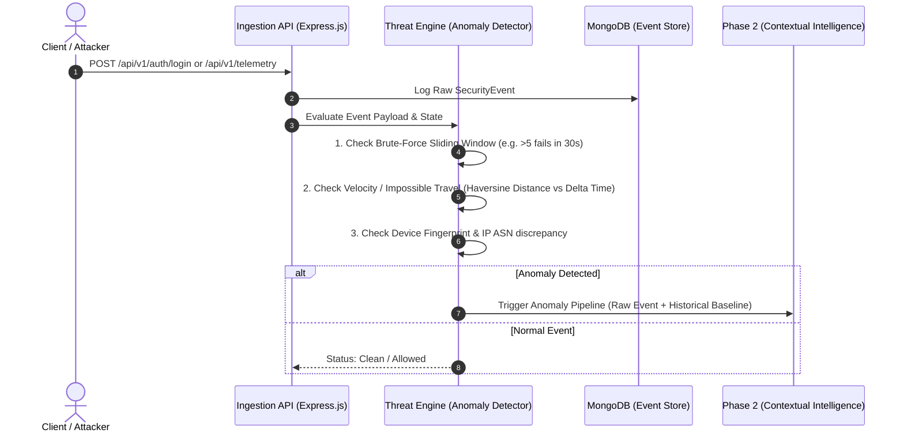
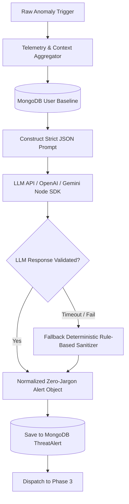
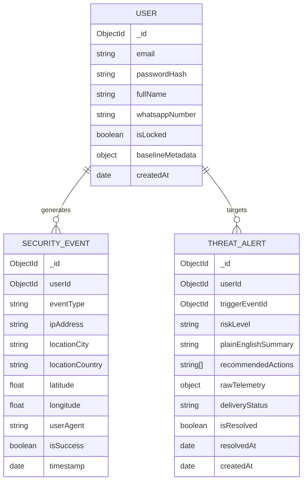

# 🏛️ NeuroLock System Architecture & Flow Engine

> **Build with भारत 2.0 National Hackathon** | Team **PARADOX**  
> *Technical Design Specification for Real-Time Threat Anomaly Detection & Zero-Jargon LLM Translation*

---

## 1. Architectural Overview

NeuroLock is engineered as an event-driven, decoupled security intelligence platform. It bridges high-throughput telemetry ingestion with modern Generative AI to eliminate the barrier of cryptic cybersecurity logs for administrators and non-technical stakeholders.

```
┌──────────────────────────────────────────────────────────────────────────────────────────────────┐
│                                    NEUROLOCK 3-PHASE ARCHITECTURE                                │
└──────────────────────────────────────────────────────────────────────────────────────────────────┘

   [ Client Traffic / Login Requests ]
                 │
                 ▼
 ┌─────────────────────────────────────────────────────────┐
 │               PHASE 1: THREAT ENGINE                   │
 │        (Node.js / Express / In-Memory State)            │
 │                                                         │
 │  • Real-time Telemetry Ingestion (POST /api/telemetry)  │
 │  • Velocity & Geo-Distance Engine (Impossible Travel)   │
 │  • Sliding-Window Rate Counter (Brute-Force Bursts)     │
 │  • Device Fingerprint & ASN Baseline Check              │
 └────────────────────────────┬────────────────────────────┘
                              │
                    [ Anomaly Detected ]
                              │
                              ▼
 ┌─────────────────────────────────────────────────────────┐
 │          PHASE 2: CONTEXTUAL INTELLIGENCE ENGINE        │
 │              (Node.js LLM Prompt Engine)                │
 │                                                         │
 │  • Context Aggregator: Enriches event with user baseline│
 │  • LLM Translation: Strips technical jargon/regex/CIDR  │
 │  • Output Synthesis: 3-Sentence plain-English summary,  │
 │    Threat Severity Level, and 1-Click Action Advice     │
 └────────────────────────────┬────────────────────────────┘
                              │
                   [ Structured Alert JSON ]
                              │
                              ▼
 ┌─────────────────────────────────────────────────────────┐
 │         PHASE 3: ZERO-JARGON MULTI-CHANNEL DELIVERY     │
 │                                                         │
 │  ┌──────────────────────────────┐  ┌─────────────────┐  │
 │  │      Web Dashboard Hub       │  │ WhatsApp Engine │  │
 │  │   (React + Tailwind + WS)    │  │ (Twilio/Meta API│  │
 │  │ • Live Incident Feed         │  │ • Push Alert    │  │
 │  │ • Telemetry Streaming Graph  │  │ • 1-Click Lock  │  │
 │  │ • 1-Click Mitigation Controls│  │   Response Link │  │
 │  └──────────────────────────────┘  └─────────────────┘  │
 └─────────────────────────────────────────────────────────┘
```

---

## 2. Deep Dive: The 3-Phase Flow Engine

### Phase 1: Threat Engine (Detection & Heuristics)
The Threat Engine is built on Node.js and Express. It acts as the frontline gatekeeper that processes authentication and network events at microsecond latency.



#### Core Heuristic Rules:
1. **Velocity & Impossible Travel**:
   $$\text{Speed} = \frac{\text{HaversineDistance}(\text{Coord}_1, \text{Coord}_2)}{\Delta t}$$
   If $\text{Speed} > 800\text{ km/h}$, an **Impossible Travel Anomaly** is flagged.
2. **Brute-Force & Burst Frequency**:
   Maintains an in-memory sliding window map `Map<UserId_or_IP, Array<Timestamp>>`. If failed attempts within a 30-second window exceed the threshold ($\ge 5$), a **Credential Stuffing / Brute Force Anomaly** is flagged.
3. **Fingerprint Deviation**:
   Compares `User-Agent`, browser headers, and ASN metadata against the user's established 30-day baseline in MongoDB.

---

### Phase 2: Contextual Intelligence Engine (LLM Translation)
When an anomaly is flagged, Phase 2 aggregates the raw technical telemetry and converts it into human-comprehensible language without sacrificing critical context.



#### LLM Prompt Strategy & Guardrails:
- **Input Payload to LLM**:
  ```json
  {
    "anomalyType": "IMPOSSIBLE_TRAVEL",
    "user": "alex@example.com",
    "lastKnownLocation": "Bengaluru, India (10:15 AM)",
    "currentLocation": "Frankfurt, Germany (10:28 AM)",
    "timeDeltaMinutes": 13,
    "calculatedVelocityKmH": 34600,
    "ipAddress": "185.220.101.5",
    "failedAttempts": 1
  }
  ```
- **System Instructions**:
  1. *Persona*: Elite Cyber Security Officer communicating to a non-technical small business owner.
  2. *Tone*: Calm, unambiguous, actionable.
  3. *Constraint*: Strict max 3 sentences for summary. Never output raw regex, CIDR notation, or low-level status codes. Provide 2 clear next steps.

---

### Phase 3: Zero-Jargon Multi-Channel Delivery
Phase 3 broadcasts the enriched alert across two primary interfaces:

1. **Real-Time Security Dashboard (React.js + Tailwind CSS)**:
   - Utilizes `Socket.io-client` connection to display live notifications.
   - Interactive severity indicators: `CRITICAL` (Red), `HIGH` (Orange), `MEDIUM` (Yellow), `LOW` (Blue).
   - Real-time action buttons: **"Lock Account Instantly"**, **"Mark as False Positive"**, **"Reset Credentials"**.

2. **Mobile / Instant Messaging Pipeline (WhatsApp via Twilio / Meta API)**:
   - Pushes instantaneous text alerts formatted for mobile readability.
   - Includes a secure 1-click webhook link allowing users to freeze their compromised account in seconds.

---

## 3. Database Schema Models (MongoDB & Mongoose)



---

## 4. API & WebSocket Contracts

### 4.1 REST API Specifications

#### `POST /api/v1/auth/login`
Validates user login and triggers security telemetry evaluation.
- **Request Body**:
  ```json
  {
    "email": "sarah@company.in",
    "password": "••••••••",
    "deviceFingerprint": "browser-hash-xyz-982"
  }
  ```
- **Response (200 OK)**:
  ```json
  {
    "success": true,
    "token": "jwt_token_here",
    "user": { "id": "64f1a2...", "email": "sarah@company.in" }
  }
  ```

#### `POST /api/v1/telemetry/event`
Ingests generic application traffic or authentication attempts from client systems.
- **Request Body**:
  ```json
  {
    "userId": "64f1a2...",
    "eventType": "LOGIN_ATTEMPT",
    "ipAddress": "103.21.244.0",
    "location": { "city": "Mumbai", "country": "India", "lat": 19.0760, "lon": 72.8777 },
    "userAgent": "Mozilla/5.0 ...",
    "isSuccess": false
  }
  ```
- **Response (202 Accepted)**:
  ```json
  {
    "status": "queued_for_analysis",
    "eventId": "65b90f..."
  }
  ```

#### `GET /api/v1/alerts`
Retrieves paginated, zero-jargon security alerts for the dashboard feed.
- **Query Params**: `?limit=20&riskLevel=CRITICAL`
- **Response (200 OK)**:
  ```json
  {
    "alerts": [
      {
        "id": "alt_99182",
        "timestamp": "2026-09-02T12:45:00Z",
        "riskLevel": "CRITICAL",
        "plainEnglishSummary": "Someone in Moscow, Russia just attempted 12 rapid logins to Sarah's account within 15 seconds. This resembles an automated password-guessing attack.",
        "recommendedActions": [
          "Lock account immediately",
          "Force password reset on next login"
        ],
        "isResolved": false
      }
    ]
  }
  ```

#### `POST /api/v1/alerts/:id/resolve`
Applies 1-click remediation.
- **Request Body**: `{ "action": "LOCK_ACCOUNT" }`
- **Response (200 OK)**: `{ "success": true, "message": "Account locked and user notified via WhatsApp." }`

---

### 4.2 WebSocket Contract (`Socket.io`)

- **Event `connection`**: Client authenticates with Bearer token.
- **Emitted Event `alert:new`**:
  ```json
  {
    "alertId": "alt_99182",
    "riskLevel": "CRITICAL",
    "plainEnglishSummary": "Unusual login attempt from Frankfurt, Germany detected.",
    "recommendedActions": ["Lock Account", "Dismiss"],
    "timestamp": "2026-09-02T12:45:00.000Z"
  }
  ```
- **Emitted Event `telemetry:stream`**: Live heartbeat of incoming raw traffic requests for real-time visualization.

---

## 5. Contributor Directory Boundaries

To guarantee zero merge collisions during hackathon development:

```
┌──────────────────────────────────────┐     ┌──────────────────────────────────────┐
│        FRONTEND DEVELOPERS           │     │         BACKEND DEVELOPERS           │
│        Working Dir: /frontend        │     │        Working Dir: /backend         │
├──────────────────────────────────────┤     ├──────────────────────────────────────┤
│ • React UI / Components              │     │ • Node.js / Express Controllers      │
│ • Tailwind CSS & Animations          │     │ • MongoDB Schemas & Aggregations     │
│ • Socket.io-client Handlers          │     │ • Anomaly Heuristic Algorithms       │
│ • State Management & Lucide Icons    │     │ • LLM Prompt Engine & WhatsApp Hooks │
└──────────────────────────────────────┘     └──────────────────────────────────────┘
```
